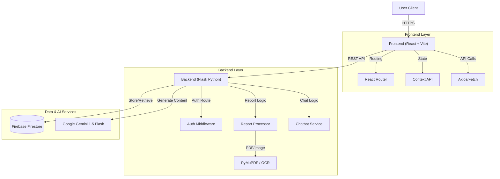

# MedExplain - AI Powered Medical Report Simplifier

**Bridging the gap between complex medical diagnostics and patient understanding.**

MedExplain is an advanced, AI-powered platform designed to demystify medical reports. By leveraging state-of-the-art Large Language Models (LLMs) and a unified, accessible design system, MedExplain transforms dense medical reports into clear, modular, visual, and actionable insights, making healthcare information accessible to everyone.


---

## 🚀 Key Features

### 1. 📄 Smart PDF Report Analysis
*   **Modular Insight Blocks**: Key findings are categorized (e.g., Blood Health, Liver Function) and visually tagged with status indicators (`Positive`, `Warning`, `Negative`, `Neutral`).
*   **Detailed Explanations**: Patient-friendly summaries that break down:
    *   **What**: The report's purpose.
    *   **Findings**: Key metrics in plain English.
    *   **Ranges**: Values within and outside normal limits.
    *   **Care**: General wellness tips based on the data.
*   **Data Visualization**: Numerical metrics are automatically extracted and plotted as charts.

### 2. 📉 Clinical Report Comparison & Trends
*   **Side-by-Side Analysis**: Compare an "Old Report" vs. "New Report" to track health changes.
*   **Visual Trend Charts**: Interactive bar charts visualize changes in vital metrics (e.g., Hemoglobin, Cholesterol) over time.
*   **Progress Tracking**: AI alerts if metrics have "Improved", "Worsened", or remained "Stable".

### 3. 💬 Context-Aware Medical Chatbot
*   **Report-Grounded Answers**: The chatbot answers questions *specifically* based on your uploaded report data.
*   **Safety First**: Strictly instructed to explain and clarify, not diagnose or prescribe.

### 4. 🩻 Interactive Body Guide & Tools
*   **Organ Explorer**: Visual guide connecting body parts to relevant lab tests.
*   **Medicine Decoder**: Identify pills, their purpose, best time to take, and side effects.
*   **Symptom Checker**: Educational guidance for common symptoms.

### 5. 🌍 Multi-Language Support
*   **Languages**: Fully supports **English**, **Hindi**, and **Marathi**.
*   **Localized Experience**: Get summaries, insights, and answers in your preferred language.

---

## 🏗️ System Architecture

MedExplain follows a modern client-server architecture, leveraging the power of Python for backend processing and React for a responsive frontend.



---

## 🛠️ Technology Stack

### **Frontend**
*   **Framework**: [React 19](https://react.dev/)
*   **Build Tool**: [Vite](https://vitejs.dev/)
*   **Styling**: [Tailwind CSS v4](https://tailwindcss.com/) (Custom "Teal" Premium Theme)
*   **Icons**: [Lucide React](https://lucide.dev/)
*   **Visualization**: [Recharts](https://recharts.org/) (for trend plotting)
*   **Markdown**: `react-markdown`, `remark-gfm`

### **Backend**
*   **Server**: [Flask](https://flask.palletsprojects.com/) (Python 3.10+)
*   **AI Model**: **Google Gemini 1.5 Flash** (`google-genai`)
*   **Database**: [Firebase Firestore](https://firebase.google.com/) (NoSQL)
*   **Authentication**: Firebase Auth (Admin SDK)
*   **PDF Processing**: `PyMuPDF`, `Pytesseract`
*   **Audio/Voice**: `gTTS` (Google Text-to-Speech), `SpeechRecognition`

---

## 📂 Directory Structure

```plaintext
MedExplain/
├── Backend/                 # Python Flask Server
│   ├── routes/              # API Route Blueprints
│   │   ├── auth_routes.py
│   │   ├── chatbot_routes.py
│   │   ├── report_routes.py
│   │   └── ...
│   ├── services/            # Business Logic & AI Integration
│   ├── middleware/          # Auth & Validation
│   ├── app.py               # Entry Point
│   └── requirements.txt     # Python Dependencies
│
├── frontend/                # React Vite Application
│   ├── src/
│   │   ├── components/      # Reusable UI Components
│   │   ├── services/        # API Handling
│   │   ├── pages/           # Main Route Views
│   │   └── App.jsx          # Root Component
│   ├── package.json         # Node Dependencies
│   └── vite.config.js       # Vite Configuration
```

---

## 🔌 API Documentation

### **1. Report Management** (`/reports`)

| Method | Endpoint | Description | Body / Query |
| :--- | :--- | :--- | :--- |
| **POST** | `/upload` | Upload and analyze a medical report. | `FormData`: `file` (PDF/Img), `reportType`, `language` |
| **GET** | `/` | List all processed reports for the user. | *None* |
| **GET** | `/summary` | Get the detailed summary of a specific report. | `?name=...&type=...` |

### **2. Chatbot** (`/chatbot`)

| Method | Endpoint | Description | Body / Query |
| :--- | :--- | :--- | :--- |
| **POST** | `/session` | Start a new chat session grounded in a report. | JSON: `{ "reportName": "...", "reportType": "...", "language": "..." }` |
| **POST** | `/message` | Send a message to the AI. | JSON: `{ "sessionId": "...", "message": "...", "language": "..." }` |
| **GET** | `/session/<id>` | Retrieve chat history for a session. | *None* |

### **3. Authentication** (`/auth`)

| Method | Endpoint | Description |
| :--- | :--- | :--- |
| **POST** | `/verify` | Verifies Firebase ID token and creates user session. |

### **4. Auxiliary Tools**
*   **Medicine Decoder** (`/medicine`): Identify medicines and their usage.
*   **Symptom Checker** (`/symptom-checker`): Analyze symptoms.
*   **Medical Terms** (`/medical-term`): Definitions of complex terms.

---

## ⚡ Installation & Setup

### **Prerequisites**
*   **Node.js** (v18+)
*   **Python** (v3.8+)
*   **Google Gemini API Key**
*   **Firebase Project Credentials** (`serviceAccountKey.json`)

### **1. Clone the Repository**
```bash
git clone https://github.com/Joshua16vinu/MedExplain.git
cd MedExplain

```
---

### **2. Backend Setup**
```bash
cd Backend

# Create and activate virtual environment
python -m venv venv
# Windows:
venv\Scripts\activate
# Mac/Linux:
source venv/bin/activate

pip install -r requirements.txt
```

**Configuration**:
Create a `.env` file in `Backend/` with:
```env
GEMINI_API_KEY=your_key_here
PORT=8080
```
*Place your `serviceAccountKey.json` inside the `Backend/` folder.*

**Run Server**:
```bash
python app.py
```

### **3. Frontend Setup**
```bash
cd frontend
npm install

# Start development server
npm run dev
```
Access the app at `http://localhost:5173`.

---

## Disclaimer

**MedExplain is an educational tool.**
It uses Artificial Intelligence to explain medical data but **does NOT provide medical diagnoses**.
*   Always consult a qualified doctor for medical advice.
*   Do not make health decisions solely based on this application's output.

---

**© 2026 MedExplain. Built by Blind Coders with ❤️**
